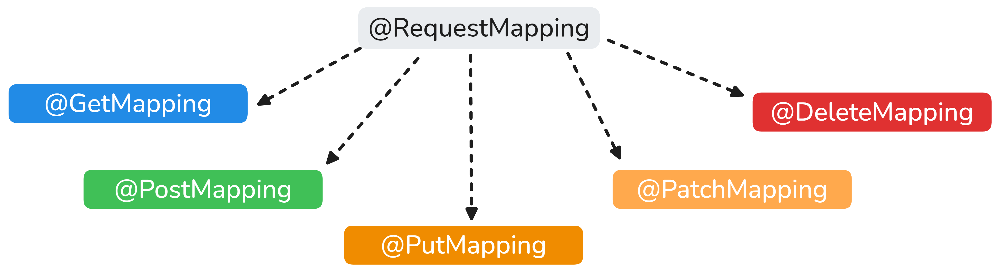
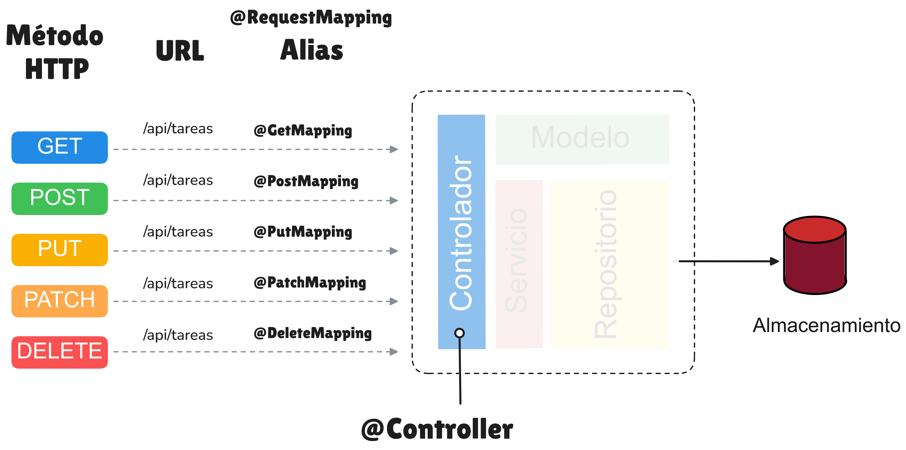
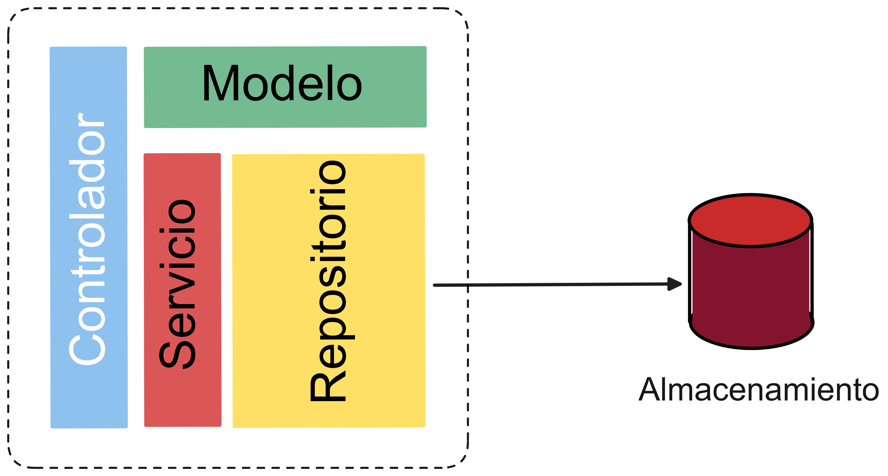
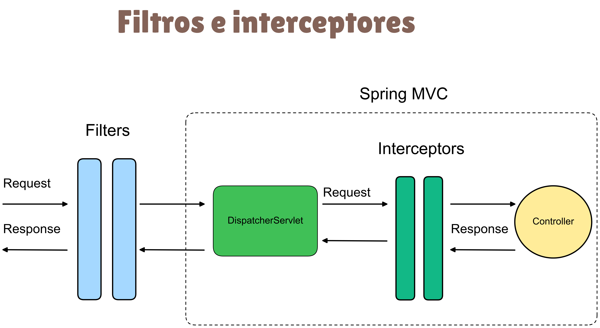

# Proyecto TO DO 

Proyecto de administración de tareas enfocado al aprendizaje del framework Spring MVC.

## Contenido

* [Proyecto TO DO ](#proyecto-to-do-)
    * [Pre-requisitos](#pre-requisitos)
    * [Instalación y configuración del proyecto](#instalación-y-configuración-del-proyecto)
        * [Clonar el repositorio en Github](#clonar-el-repositorio-en-github)
    * [Clonar el repositorio](#clonar-el-repositorio)
    * [Cambiarse al repositorio descargado](#cambiarse-al-repositorio-descargado)
        * [Activar la base de datos mongodb](#activar-la-base-de-datos-mongodb)
        * [Levantar el proyecto con spring boot](#levantar-el-proyecto-con-spring-boot)
    * [Para linux o macos](#para-linux-o-macos)
    * [Para windows](#para-windows)
        * [Validar](#validar)
    * [Estructura del proyecto](#estructura-del-proyecto)
    * [Patron IoC](#patron-ioc)
    * [Principales anotaciones](#principales-anotaciones)
        * [La anotación @Controller](#la-anotación-@controller)
        * [La anotación @RequestMapping](#la-anotación-@requestmapping)
        * [La anotación @ModelAttribute](#la-anotación-@modelattribute)
        * [La anotación @PathVariable](#la-anotación-@pathvariable)
        * [La anotación @RequestParam](#la-anotación-@requestparam)
        * [La anotación @Value](#la-anotación-@value)
        * [La anotación @Autowired](#la-anotación-@autowired)
        * [La anotación @Qualifier](#la-anotación-@qualifier)
        * [La anotación @Primary](#la-anotación-@primary)
        * [La anotación @Configuration`](#la-anotación-@configuration)
        * [La anotaciones @Repository, @Service, @Controller](#la-anotaciones-@repository,-@service,-@controller)
        * [La anotaciones @Scanneo de componentes](#la-anotaciones-@scanneo-de-componentes)
        * [La anotaciones Recursos estáticos](#la-anotaciones-recursos-estáticos)

## Pre-requisitos
Para poder utilizar el repositorio actual, se deberá de cumplir con los siguientes requerimientos:

- [Open JDK 21](https://openjdk.org/projects/jdk/21/) o mayor
- [Docker](https://www.docker.com/get-started/)
- [Git](https://git-scm.com/downloads)
- [VSCode](https://code.visualstudio.com/download)
- [Mongo DB Compass](https://www.mongodb.com/products/tools/compass)
- Algún cliente Rest como: [Insomnia](https://insomnia.rest/), [Postman](https://www.postman.com/) o [CURL](https://curl.se/)


## Instalación y configuración del proyecto

Para implementar este proyecto ejecuta los siguientes pasos

### Clonar el repositorio en Github

Las siguientes operaciones se deberán de llevar a cabo a través de la línea de comandos:


```shell
## Clonar el repositorio
git clone git@github.com:calmecac-community/todo.git

## Cambiarse al repositorio descargado
cd todo
```

### Activar la base de datos mongodb

```shell
docker compose -f src/main/docker/mongodb.yml up -d
```

### Levantar el proyecto con spring boot

```shell
## Para linux o macos
./mvnw spring-boot:run

## Para windows
./mvnw.cmd spring-boot:run
```

### Validar

Abre un navegador web y coloca la siguiente ruta:

```shell
http://localhost:8080/api/info
```

En la página web, se debeŕa de ver un resutlado parecido al siguiente:

```json
{
  "appName": "todo",
  "description": "Demo project for Spring Boot",
  "version": "0.0.1-SNAPSHOT",
  "port": "8080"
}
```

## Estructura del proyecto

```shell
──src
  ├── main
  │   ├── docker
  │   ├── java
  │   │   └── mx
  │   │       └── calmecac
  │   │           └── todo
  │   │               ├── controllers
  │   │               ├── dtos
  │   │               ├── mappers
  │   │               ├── model
  │   │               ├── repositories
  │   │               └── services
  │   └── resources
  │       ├── static
  │       └── templates
  └── test
      └── java
          └── mx
              └── calmecac
                  └── todo
```


|  Directorio | Descripción  |
|---|---|
|`src/main/java/mx/calmecac/todo/controllers`| Controladores que atienden las peticiones HTTP de un request. Los archivos tienen el sifujo `Controler.java` |
|`src/main/java/mx/calmecac/todo/services`| Definición de las clases que implementan la lógica de negocio. Los archivos tienen el sufijo  `Service.java` |
|`src/main/java/mx/calmecac/todo/model`| Definición de las entidades que representan el modelo de dominio del proyecto|
|`src/main/java/mx/calmecac/todo/repositories`| Clases que acceden a la base de datos. Los archivos tienen el sufijo `Repository.java` |
|`src/main/java/mx/calmecac/todo/dtos`| Los archivos tienen el sufijo  `Dto.java` |
|`src/main/resources/static`| Se guardan los archivos utilizados en las vistas html del proyecto. Los archivos tienen extensiiones .png, .jpg, .svg, etc |
|`src/main/resources/templates`| Se guardan las plantillas de las vistas Thymeleaf. Aquí van los archivos con extensión `.html`
|`src/main/test`| Se guardan las clases que continenen las pruebas unitarias del proyecto


## MVC ( Modelo Vista Controlador)

MVC (Modelo-Vista-Controlador) es un patrón en el diseño de software comúnmente utilizado para implementar interfaces de usuario, datos y lógica de control. Enfatiza una separación entre la lógica de negocios y su visualización. Esta "separación de preocupaciones" proporciona una mejor división del trabajo y una mejora de mantenimiento. Algunos otros patrones de diseño se basan en MVC, como MVVM (Modelo-Vista-modelo de vista), MVP (Modelo-Vista-Presentador) y MVW (Modelo-Vista-Whatever).

## Principales anotaciones
### La anotación @Controller

La anotación `@Controller` le indica al Framework de Spring que la Clase decorada es un controlador.

 
```java
import org.springframework.web.bind.annotation.RequestMapping;
import org.springframework.web.bind.annotation.RestController;

@Controller
public class TareaController {

    @RequestMapping("/tareas")
    public String showTareas(Model model) {
        model.addAttribute("titulo", "Gestor de tareas desde variable");
        model.addAttribute("subtitulo", "Lista de tareas desde variable");       
        return "tareas";
    }

}
```
### La anotación @RequestMapping

Se puede utilizar la anotación `@RequestMapping` para asignar solicitudes a métodos de un controlador. Se puede utilizar a nivel de clase para expresar asignaciones compartidas o a nivel de método para limitarse a una asignación específica.


Existen atajos específicos de `@RequestMapping` para los métodos más comúnes del protocolo HTTP:



Estos atajos son anotaciones que heredan las características de la anotación `@RequestMapping` con la finalidad de escribir código más simple de leer.

En la siguiente ilustración se muestran los principales métodos HTTP y su respectivo atajo o alias:



A continuación se muestran algunos ejemplos en código java.

#### @GetMapping

Generalmente, la anotación `@GetMapping` se utiliza para manejar peticiones HTTP que tienen como objetivo consultar uno o máS recurso; es decir, peticiones de sólo lectura;


```java
@RequestMapping(value="/tareas", method=RequestMethod.GET)
public List<Tarea> getTareas(){
    // implementación del método
    return tareas;
}
```

Su atajo es:

```java
@GetMapping("/tareas")
public List<Tarea> getTareas(){
    // implementación del método
    return tareas;
}
```

#### @PostMapping

Generalmente, la anotación `@PostMapping` se utiliza para manejar peticiones HTTP que tienen como objetivo crear uno o más recurso; es decir, peticiones de escritura;

```java
@RequestMapping(value="/tareas", method=RequestMethod.POST)
public Tarea createTareas(){
    // implementación del método
    return tarea;
}
```

Su atajo es:

```java
@PostMapping("/tareas")
public Tarea createTareas(){
    // implementación del método
    return tarea;
}
```

#### @PutMapping

Generalmente, la anotación `@PutMapping` se utiliza para manejar peticiones HTTP que tienen como objetivo actualizar uno o más recurso
```java
@RequestMapping(value="/tareas", method=RequestMethod.PUT)
public Tarea createTareas(){
    // implementación del método
    return tarea;
}
```

Su atajo es:

```java
@PutMapping("/tareas}")
public Tarea updateTarea(){
    // implementación del método
    return tarea;
}
```

#### @PatchMapping

Generalmente, la anotación `@PatchMapping` se utiliza para manejar peticiones HTTP que tienen como objetivo actualizar uno o máS recurso de manera parcial.

```java
@RequestMapping(value="/tareas", method=RequestMethod.PATCH)
public Tarea partialUpdateTareas(){
    // implementación del método
    return tarea;
}
```

Su atajo es:

```java
@PatchMapping("/tareas}")
public Tarea partialUpdateTareas(){
    // implementación del método
    return tarea;
}
```

#### @DeleteMapping

Generalmente, la anotación `@DeleteMapping` se utiliza para manejar peticiones HTTP que tienen como objetivo eliminar físicamente o lógicamente uno o más recurso

```java
@RequestMapping(value="/tareas", method=RequestMethod.DELETE)
public void deleteTareas(){
    // implementación del método
    return;
}
```

Su atajo es:

```java
@DeleteMapping("/tareas}")
public void deleteTarea(){
    // implementación del método
    return;
}
```

### La anotación @ModelAttribute

```java
public class BaseController {

    @ModelAttribute("usuario")
    public Usuario getUsuario() {
        Usuario usuario = new Usuario();
        usuario.setUsername("lacandon");
        usuario.setPrimerApellido("Lacandon Primer apellido");
        usuario.setSegundoApellido("Lacandon segundo apellido");
        return usuario;
    }
}

```
### La anotación @PathVariable

En ocasiones, vamos a requerir pasar parámetros a un servicio web. Una de las maneras de hacerlo es a través de la URL.

Por ejemplo, si tenemos un servicio que nos permite consultar un recurso especificando el ID del mismo, lo podemos acceder de la siguiente manera:

```shell
GET /api/tarea/42
```

En el caso anterior, estamos solicitando el recurso tarea con ID = `42` a través del método `GET` del protocolo HTTP.

Para poder construir un controlador que atienda este tipo de solicitudes, spring cuenta con la anotación `@PathVariable`.

Ejemplo:

```java
@RestController
@RequestMapping("/api")
public class TareaRestController {

    @Autowired
    private TareaService service;

    @RequestMapping("/tareas/{id}")
    public Tarea getTareas(@PathVariable id) {
        return service.consultaTareaPorId(id);
    }       
}
```

### La anotación @RequestParam

Otra manera de enviar parámetros a un servicio es a través de los _query params_.

Ejemplo:

```java
@GetMapping("/tareas/filtro")
public Tarea getTareasFiltro(@RequestParam id) {
    //Consultar tarea
    return tarea;
}

```

### La anotación @Value

La anotación `@Value` puede ser utiliza para inyectar en una variable dentro de una clase. Los valores que se pueden inyectar son los definidos en el archivo application.yml

Ejemplo:

```java
@RestController
@RequestMapping("/api")
public class InfoController {

    @Value("${spring.application.name}")
    private String appName;

    @Value("${server.port}")
    private String port;

    @Value("${app.description}")
    private String description;

    @Value("${app.version}")
    private String version;
}

```

### La anotación @Autowired

La anotación `@Autowired` nos permite inyectar dependencias que son administradas por el Framework de spring, entre las cuales destacan los Servicios y los Repositorios.


Ejemplo:


```java
@RestController
@RequestMapping("/api")
public class TareaRestController {

    @Autowired
    private TareaService service;

    @RequestMapping("/tareas")
    public List<Tarea> getTareas(TareaFiltro filtro) {
        return service.consultaTareas(filtro);
    }
}

```
### La anotación @Qualifier
Cuando existe una o más implementaciones de una interfaz y dichas implementaciones han sido anotadas con `@Service`, Spring no sabe que dependencia inyectar a menos que se le diga de manera explicita a través de la anotación `@Qualifier`.


### La anotación @Primary

Adicionalmente a la anotación `@Qualifier`, existe otra manera de resolver el servicio que se debe de inyectar cuando existen varios disponibles y es a través de la anotación `@Primary`. Con esta anotación, se le dice a spring que inyecte por default el servicio anotado con `@Primary`.

Ejemplo:


```java
@Service
@Primary
public class TareaDbService implements TareaService {

}

```
### La anotación @Configuration`

La anotación `@Configuration` es parte del marco Spring Core. La anotación indica que la clase tiene métodos de definición de `@Bean` y que deberán de incluirse en el contexto global del aplicativo. De este modo, el contenedor Spring puede procesar la clase y generar Clases manejadas para usar en la aplicación.

Ejemplo:

```java
@Configuration
public class AppConfig {

    @Bean
    public Version version() {
        return new Version(1, 0, 0);
    }
}
```

### La anotaciones @Controller, @Service y @Repository

Un servicio web está conformado por un conjunto de capas. Una capa es un conjunto de componentes o módulos de software que se encargan de realizar una función específica dentro del sistema. Cada capa o nivel se comunica con las capas adyacentes a través de una interfaz bien definida, lo que permite la separación de responsabilidades y la modularidad del sistema. 

En su minima expresión, un componente de software está compuesto por cinco capas: 

1. Capa de Control o Controlador,
2. Capa de Servicio o lógica de negocio, 
3. Capa de Modelo, 
4. Capa de Repositorio o Acceso a datos.



**Controlador**

Se encarga de manejar todas las peticiones REST que llegan al componente antes de pasarlas a la capa de servicio. Las clases definidas en esta capa implementan la lógica de un controlador y identificadas al agregarles la anotación `@Controller`

Ejemplo de un `@Controller`

```java
@Controller
public class TareaController {

    @RequestMapping("/tareas")
    public String showTareas(Model model) {
        model.addAttribute("titulo", "Gestor de tareas desde variable");
        model.addAttribute("subtitulo", "Lista de tareas desde variable");
        return "tareas";
    }
}

```

**Servicio**

Se encarga de implementar la lógica de negocio de un componente. Las clases definidas en esta capa se indentifican con la anotación `@Service`

Ejemplo:

```java
@Service
public class TareaDbService {

    @Autowired
    private TareaRepository repository;

    public Tarea guardarTarea(Tarea tarea) {
        return repository.save(tarea);
    }
    // otros métodos
}

```

**Modelo**

En esta capa sólo existen los elementos del modelo de dominio que implementa el componente. En esta capa sólo existen clases simples con propiedades y sus respectivos métodos Set y Get.

Ejemplo de una clase de Modelo:


```java

public class Tarea {

    private String id;
    private String nombre;
    private String descripcion;

    // Métodos Set y Get para cada propiedad
}

```
**Repositorio**

Se encarga de guardar, recuperar y actualizar los elementos del modelo de dominio de un proyecto mediante un dispositivo de almacenamiento. Las clases definidas en esta capa se encargar de acceder a una repositorio de información y realizar las operaciones de creación, actualización, eliminación y consulta de elementos almacenados. Las clases son identificadas con la anotación`@Repository`.


Ejemplo de un `@Repository`

```java
@Repository
public interface TareaRepository extends MongoRepository<Tarea, String>{}
```


### La anotaciones @SpringBootApplication

Los proyectos Spring Boot permiten tener aplicaciones que utilicen configuración automática, escaneo de componentes y que puedan definir configuraciones adicionales en su "clase de aplicación". Se puede usar una única anotación `@SpringBootApplication` para habilitar esas tres características, es decir:

`@EnableAutoConfiguration`: habilitar el mecanismo de configuración automática de Spring Boot
`@ComponentScan:` habilite el escaneo @Component en el paquete donde se encuentra la aplicación
`@SpringBootConfiguration`: habilitar el registro de componentes adicionales en el contexto o la importación de clases de configuración adicionales.


Ejemplo:

```java
@SpringBootApplication(scanBasePackages = {"mx.calmecac.todo", "mx.calmecac.otro"})
public class TodoApplication {
	public static void main(String[] args) {
		SpringApplication.run(TodoApplication.class, args);
	}
}
```

### La anotaciones RestControllerAdvicer

Para poder interceptar Excepciones lanzadas en el aplicativo y poder manejarlas de manera centralizada se puede utilizar las anotaciones `@RestControllerAdive` y `@ExceptionHandler`. 

```java
@RestControllerAdvice
public class ExceptionErrorHandler {

    @ExceptionHandler(Exception.class)
    public ResponseEntity<String> generalError(Exception ex) {
        return ResponseEntity.internalServerError().body("Error general capturado");
    }

}

```
### Definición de filtros e interceptores

Los filtros e interceptores nos permiten capturar la peticiones que se le hacen al servicio web antes de que lleguen a él, de tal manera que podamos manipular las peticiones y realizar operaciones antes de que sea procesada una solicitud, permitiendo un control completo sobre el aplicativo.

Primero se aplican los filtros y depués los interceptores.




#### Definición de filtros

Para definir un filtro se debe implementar la interfaz `Filter` y anotar la clase con `@Component` como se muestra a continuación:

```java
import java.io.IOException;

import org.springframework.stereotype.Component;

import jakarta.servlet.Filter;
import jakarta.servlet.FilterChain;
import jakarta.servlet.ServletException;
import jakarta.servlet.ServletRequest;
import jakarta.servlet.ServletResponse;
import lombok.extern.log4j.Log4j2;

@Component
@Log4j2
public class LogFilter implements Filter {

    @Override
    public void doFilter(ServletRequest request, ServletResponse response, FilterChain chain)
            throws IOException, ServletException {
        log.info("IP ADDR: " + request.getLocalAddr());
        chain.doFilter(request, response);
    }

}

```

#### Definición de Interceptores

Para definir un interceptor se tienen que realizar dos pasos:

1. Definir el interceptor
2. Configurar el interceptor dentro de Spring MVC


Primero, vamos a definir el interceptor como se muestra a continuación:


```java
import org.springframework.stereotype.Component;
import org.springframework.web.servlet.HandlerInterceptor;
import org.springframework.web.servlet.ModelAndView;

import jakarta.servlet.http.HttpServletRequest;
import jakarta.servlet.http.HttpServletResponse;
import lombok.extern.log4j.Log4j2;

@Log4j2
@Component
public class LogInterceptor implements HandlerInterceptor {


    @Override
    public boolean preHandle(HttpServletRequest request, HttpServletResponse response, Object handler) 
      throws Exception {
        log.info("preHandle");
        return true;
    }

    @Override
    public void postHandle(HttpServletRequest request, HttpServletResponse response, Object handler, ModelAndView modelAndView) 
      throws Exception {
        log.info("postHandle");
    }

    @Override
    public void afterCompletion(HttpServletRequest request, HttpServletResponse response, Object handler, Exception ex) 
      throws Exception {
        log.info("afterCompletion");
    }

}

```

En seguida, vamos a configurar el interceptor para que Spring MVC lo pueda incluir en su ciclo de ejecución. Para realizar esta tarea, vamos a crear una clase de configuración llamada `WebConfigurer.java`

```java
import org.springframework.beans.factory.annotation.Autowired;
import org.springframework.context.annotation.Configuration;
import org.springframework.web.servlet.config.annotation.InterceptorRegistry;
import org.springframework.web.servlet.config.annotation.WebMvcConfigurer;

@Configuration
public class WebConfigurer implements WebMvcConfigurer {

    @Autowired
    private LogInterceptor logInterceptor;

    @Override
    public void addInterceptors(InterceptorRegistry registry) {
        registry.addInterceptor(logInterceptor).addPathPatterns("/api/**");
    }
}
```

[](/LICENSE)


